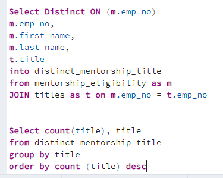
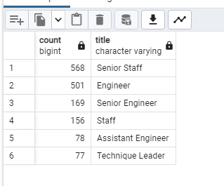

# Pewlett-Hackard-Analysis

## Overview of the Analysis
The purpose of the analysis was to provide Bobby with information regarding employees who are retiring and what their titles are. In addition, Bobby also wants to know which employees are eligibile to participate in the mentorship program. THis will help Bobby prepare for employees who are reaching retirement age

## Results
 * As noted in the retiring title csv, senior engineers are the most number of titles with an upcoming retiremented followed by senior staff
 * Title with the least retirements are managers
 * There are a total of 1549 total employees eligible for the mentorship program
 * It would be interesting to note which staff had a change in role in the past few years, prior to retirement. They may also provide more support in the mentorship program if they had other roles

## Summary 
### Roles to be filled
As the "silver tsumani" beigns to make its impact there will be a total of 49,458 roles that will need to be filled in various titles.

### Additional information
Based on the additioanl query and table as noted below, there are not enough staff to provide mentorship for the roles that need to be filled. There is also a notable difference that the titles for those retiring are not available in the mentorship program. As noted in the two queries below, there is a gap between roles that are retiring and mentors available for mentorship

